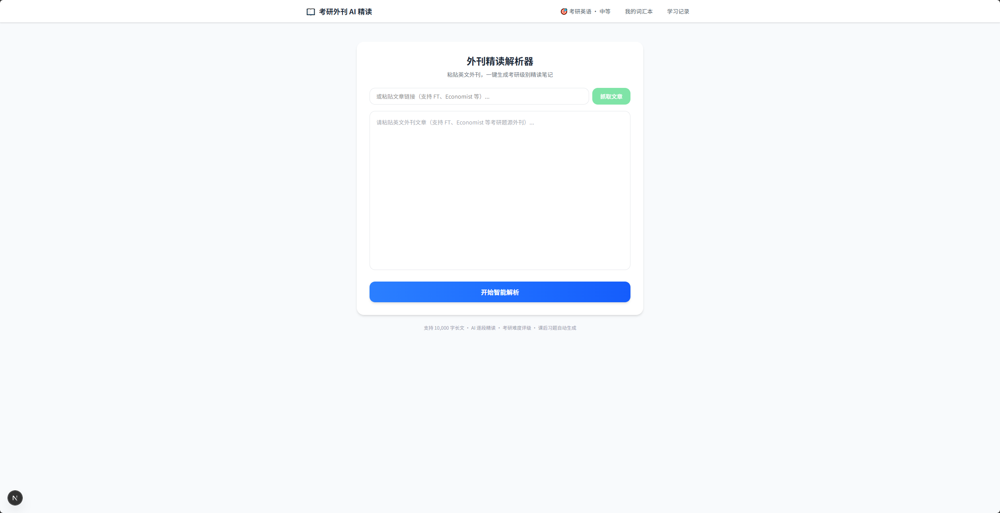
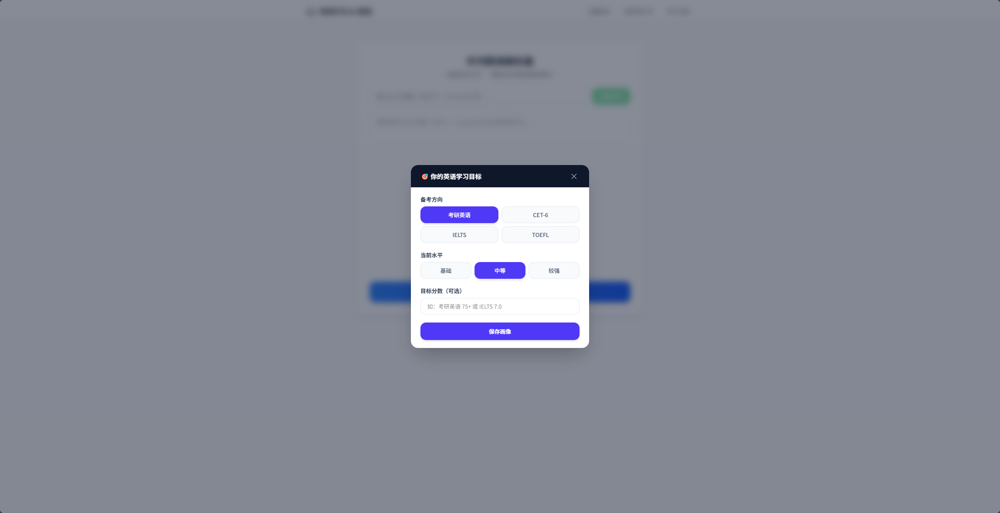
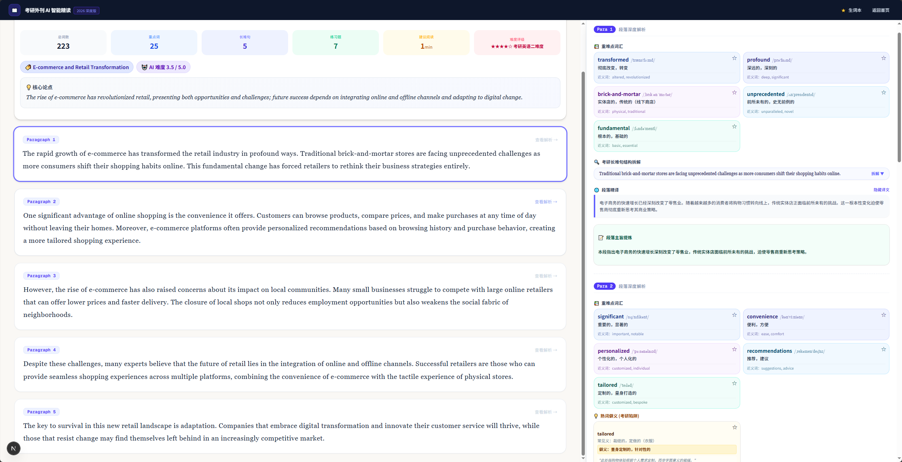
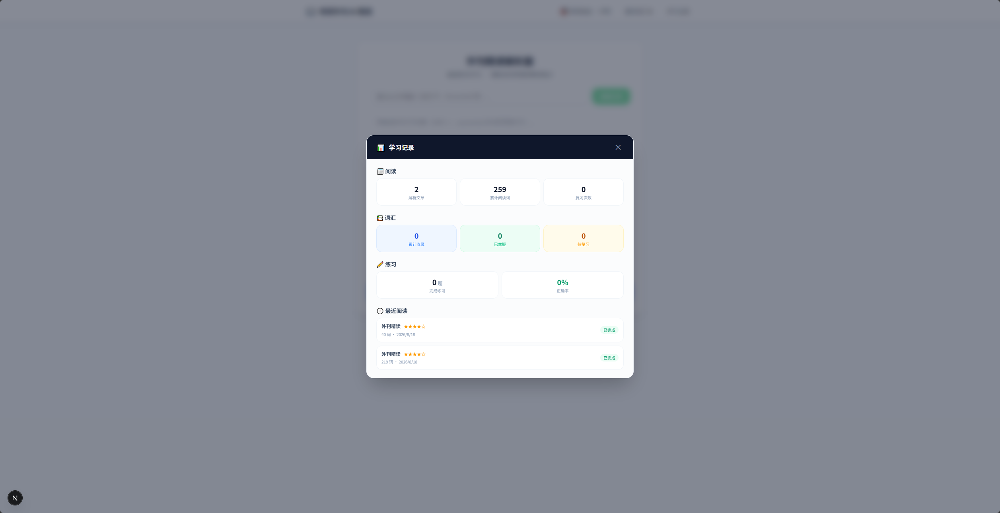

# 📖 AI English Reading Assistant

> **A personalized AI-powered reading and learning assistant for English learners.**

一个面向考研、CET-6、IELTS、TOEFL 等英语学习者的 **AI 外刊精读与学习系统**。

用户只需粘贴英文文章或输入文章 URL，系统即可基于用户的考试目标与英语水平，自动生成：

- 📚 重难点词汇（音标 / 释义 / 同义词）
- 🔍 熟词僻义识别
- 🧩 长难句结构分析
- 🇨🇳 段落翻译与总结
- 📝 阅读理解与翻译练习
- 🧠 间隔重复复习
- 📊 学习数据追踪

**一句话定位**：把一次性的「AI 文章解析」升级为持续性的「个性化 AI 学习系统」。

**🚀 [Live Demo](https://ai-english-reading-assistant.netlify.app/)** ·
**💻 [GitHub](https://github.com/cygu19730-ai/AI-English-Reading-Assistant)**

`AI + User Profile + Learning Science`



---

## 🚀 Live Demo

### 👉 [体验 AI English Reading Assistant](https://ai-english-reading-assistant.netlify.app/)

无需安装，打开网页即可体验完整功能：设置用户画像 → 粘贴文章或输入 URL → 获得 AI 精读解析。

全栈公网部署：

| 服务 | 平台 | 地址 |
|------|------|------|
| Frontend (Next.js) | Netlify | https://ai-english-reading-assistant.netlify.app/ |
| Backend (FastAPI) | Render | https://ai-english-reading-assistant.onrender.com/ |

> ⚠️ Demo 使用真实 LLM API 进行文章解析。后端部署在 Render 免费实例上，长时间无人访问时会休眠，**首次请求可能需要等待约 30–60 秒冷启动**；较长文章的解析也需要一定处理时间。

---

## 🎬 Product Preview

完整产品流程：**首页 → 用户画像 → AI 精读解析 → 学习看板**

### 首页 — 文章输入


### 用户画像 — 考试类型与英语水平



### AI 精读结果 — 左右分栏沉浸式阅读



### 学习看板 — 学习数据与复习追踪



---

## 💡 Why I Built This

传统英文精读通常需要在多个工具之间切换：

> 外刊文章 → 查词典 → 看翻译 → 分析长难句 → 找题目 → 记录生词 → 背单词

这些工具解决的是单点问题，却很难形成完整的学习闭环。

同时，大多数 AI 阅读工具存在一个共同问题：

> **同一篇文章，对不同水平的用户生成几乎相同的解析。**

| 痛点 | 现有解决方案的不足 |
|------|------------------|
| 外刊文章看不懂 | 查词典费时，翻译软件只给结果不教方法 |
| 不知道哪些是考点 | 精读笔记靠人工整理，效率极低 |
| 单词背了就忘 | 背单词 App 脱离语境，记住的是孤立词义 |
| 做题没有反馈 | 真题做完对答案，不知道错在哪 |
| AI 产品不够个性化 | 所有人生成的解析完全一样，忽视个体差异 |

因此，我希望构建一个由：

> **AI + User Profile + Learning Science**

驱动的英语学习产品。核心思路：

```text
        User Profile
     (考试目标 / 水平)
              │
              ▼
        English Article
              │
              ▼
     Personalized LLM Analysis
              │
       ┌──────┼──────┐
       ▼      ▼      ▼
    Vocabulary Sentence Exercise
       │      │      │
       └──────┼──────┘
              ▼
       Learning Record
              │
              ▼
      Spaced Repetition
              │
              ▼
       Continuous Learning
```

---

## 🎯 Target Users

| 用户群体 | 核心需求 | 产品价值 |
|---------|---------|---------|
| 考研英语学习者 | 外刊精读、长难句、阅读理解 | 自动提取考点并生成考研风格练习 |
| CET-6 / IELTS / TOEFL 学习者 | 提升阅读能力与词汇量 | 根据考试目标调整解析策略 |
| 英语自学者 | 缺乏系统的精读指导 | AI 逐段拆解文章，降低学习门槛 |

**Core User Persona**：23 岁左右、英语中等水平、每天拥有 30–60 分钟学习时间，希望通过外刊提升阅读能力的学习者。

---

## ✨ Core Features

### 1. 🤖 AI Article Analysis

输入文章（手动粘贴或 URL 自动抓取）后，AI 自动完成结构化精读：

- 自动识别文章主题与核心论点（article_meta）
- 自动分段
- 重难点词汇识别（音标、释义、同义词）
- 熟词僻义识别（考研核心考点）
- 长难句结构分析
- 段落翻译 + 段落总结
- 自动生成阅读理解题（单选）与翻译练习

### 2. 🎯 Personalized Learning

用户首次使用时可以设置：

- 考试类型：考研英语 / CET-6 / IELTS / TOEFL
- 英语水平：基础 / 中等 / 较强
- 目标分数（可选）

用户画像会通过 `build_profile_prompt()` 注入 LLM Prompt，并改变 AI 的解析策略：

| 水平 | 词汇解析 | 长难句 | 练习 |
|------|---------|--------|------|
| 基础 | 更详细的解释 | 更细粒度拆解 | 难度略低 |
| 中等 | 标准解析 | 重点分析关键从句 | 强化熟词僻义，接近考试难度 |
| 较强 | 减少基础词汇 | 聚焦复杂结构 | 增加逻辑推断型练习 |

因此：**同一篇文章，不同用户可以获得不同的信息密度与学习重点。**

### 3. 🧠 Spaced Repetition

将阅读过程中遇到的生词转化为长期学习内容。

系统为每个单词记录：

```text
word / meaning / reviewCount / correctCount /
wrongCount / lastReviewed / nextReview / mastery
```

复习间隔：

```text
1 → 3 → 7 → 14 → 30 days
```

并通过用户的复习行为（主动回忆 → 判断是否掌握）动态更新掌握程度，"不认识"和"记错了"都会触发间隔重置。

相比简单的「收藏单词」，目标是形成：

> **阅读 → 练习 → 复习 → 再学习** 的学习闭环。

### 4. 📊 Learning Dashboard

系统记录用户学习行为，包括：累计阅读词数、完成练习数量、练习正确率、生词掌握情况、最近学习记录、待复习词汇。让用户能够看到：

> **"我学了什么，以及我掌握得怎么样。"**

---

## 🏗️ AI Architecture

```text
                         User
                           │
                           ▼
              ┌──────────────────────┐
              │  Netlify Deployment  │
              │  ┌────────────────┐  │
              │  │ Next.js 16     │  │
              │  │ Frontend       │  │
              │  │                │  │
              │  │ Article / URL  │  │
              │  │ User Profile   │  │
              │  │ Reading UI     │  │
              │  │ Vocabulary     │  │
              │  │ Dashboard      │  │
              │  └────────┬───────┘  │
              └───────────┼──────────┘
                          │ /api/parse, /api/fetch-url
                          ▼
              ┌──────────────────────┐
              │  Render Deployment   │
              │  ┌────────────────┐  │
              │  │ FastAPI        │  │
              │  │ Backend        │  │
              │  └───────┬────────┘  │
              └──────────┼───────────┘
                         ▼
              ┌─────────────────────┐
              │   Prompt Builder    │
              │                     │
              │  SYSTEM_PROMPT      │
              │         +           │
              │  User Profile       │
              └─────────┬───────────┘
                        ▼
              ┌─────────────────────┐
              │    DeepSeek LLM     │
              │                     │
              │  Structured JSON    │
              │    Generation       │
              └─────────┬───────────┘
                        ▼
              ┌─────────────────────┐
              │  Output Validation  │
              │                     │
              │  JSON Repair        │
              │  Pydantic Schema    │
              │  Content Validation │
              └─────────┬───────────┘
                        ▼
              ┌─────────────────────┐
              │  Structured Result  │
              └─────────┬───────────┘
                        ▼
         Reading + Practice + Review
```

---

## 🧠 LLM Application Design

### Prompt Architecture

LLM 输入不是简单的 `Article → LLM`，而是：

```text
SYSTEM_PROMPT（JSON Schema + 解析/出题/难度规则）
        +
User Profile（考试类型 / 水平 / 目标分数）
        +
ARTICLE
        ↓
    DeepSeek
```

**System Prompt** 定义：

- 输出 JSON Schema（article_meta + segments）
- 文章解析任务与分段规则
- 词汇识别与熟词僻义规则
- 长难句识别规则
- 出题策略（信息量足够的段落才出题）
- 难度评分规则（1–5）

**User Profile Prompt** 根据用户画像动态调整：

- 词汇解释粒度
- 长难句分析深度
- 翻译风格
- 练习题难度与题型

画像注入是「追加」而非「覆盖」基础提示词，保证稳定性。

---

## 🛡️ Structured Output & Reliability

LLM 输出不能直接交给前端使用。因此后端设计了三层输出处理：

```text
LLM Raw Output
       │
       ▼
┌──────────────────────┐
│ Layer 1              │
│ JSON Repair          │
│ repair_json()        │
└──────────┬───────────┘
           ▼
┌──────────────────────┐
│ Layer 2              │
│ Pydantic Validation  │
│ Schema Validation    │
│ Field Validation     │
└──────────┬───────────┘
           ▼
┌──────────────────────┐
│ Layer 3              │
│ Content Validation   │
│ Required Fields      │
│ Exercise Validation  │
└──────────┬───────────┘
           ▼
     Frontend Result
```

例如：

- `answer` 自动归一化为 `A/B/C/D`（`"A. xxx"` → `"A"`）
- 选择题强制 4 个选项，自动补全选项前缀
- 缺失字段提供默认值
- `original_text` 必须非空
- 整篇文章必须包含至少 1 道练习题

这样做的核心目标是：

> **降低 LLM 输出格式不稳定对产品体验的影响，确保前端永远拿到干净数据。**

---

## 🔧 Engineering Challenges

### Challenge 1 — LLM Output Reliability

**Problem**：LLM 并不总是严格遵守 JSON 格式，可能出现缺失逗号、Markdown code block 包裹、输出截断、字段格式不一致、选择题答案格式异常。

**Solution**：设计 `JSON Repair → Pydantic Validation → Content Validation` 三层处理管线，而不是直接 `json.loads(llm_output)`。

### Challenge 2 — Long Article Processing

**Problem**：长文章会显著增加 Prompt 长度、Output Token 数、JSON 截断风险与 API 请求时间。

**Solution**：

- `max_tokens=8000` 扩大输出空间
- API timeout 延长至 300 秒
- 前端限制输入约 **10,000 words**
- 对输出结构进行验证

### Challenge 3 — Personalization vs. Generality

**Problem**：用户画像越复杂，Prompt 越长、约束越多，生成稳定性可能下降。

**Solution**：画像只分 `Basic / Intermediate / Advanced` 三个主要能力层级，每档调整规则明确、不模糊。让个性化规则**简单、明确、可控**。

### Challenge 4 — 网络与部署环境限制

**Problem**：开发过程中遇到国内网络限制（OpenAI 无法充值、部分外刊网站无法访问）。

**Solution**：

- 改用 DeepSeek（国内可访问、可充值、中文理解强）
- 放弃 OpenAI SDK，用 `requests` 直连 API
- URL 抓取适配国内可访问的英文源
- 前后端分别部署至 Netlify 与 Render，前端通过 `NEXT_PUBLIC_API_URL` 环境变量配置后端地址

---

## 📈 Product Iteration

项目并不是一次性完成，而是按照产品迭代逐步开发：

```text
V0 — 可行性验证 ✅
│  DeepSeek API 直调 + 简单展示
│  发现：核心解析质量 OK，但缺乏个性化
▼
V1 — 核心功能 ✅
│  Structured Output + Pydantic Validation
│  URL 抓取 / 生词本 / 间隔重复 / 左右分栏 UI
▼
V2 — 个性化学习系统 ✅
│  User Profile 驱动解析策略
│  文章级概览 / 学习数据看板
▼
V3 — Public MVP ✅
│  Netlify (前端) + Render (后端) 全栈公网部署
▼
V4 — Evaluation → 下一阶段
   人工标注测试集 + 内容质量评估
```

核心迭代逻辑：

> **从"能生成" → "生成稳定" → "个性化" → "形成学习闭环" → "真实部署"。**

---

## 📊 Evaluation

当前项目已实现工程层面的输出质量检查：

| Evaluation Dimension | Current Method |
|----------------------|----------------|
| JSON Validity | `json.loads()` 成功率 |
| Schema Validity | Pydantic 校验通过率 |
| Field Completeness | 关键字段非空检查 |
| Exercise Generation | 最少练习题数量校验 |
| Output Structure | Structured response schema |

### Next Evaluation Stage

下一阶段计划建立小规模人工标注数据集，对以下能力进行评估：

- 重难点词识别、熟词僻义识别
- 长难句识别与拆解质量
- 段落总结与翻译质量
- 阅读理解题质量
- 不同用户画像下的个性化差异

> **目前尚未人为构造或虚报模型准确率，后续指标将在实际评测后补充。**

---

## 🛠️ Tech Stack

| Layer | Technology | Purpose |
|-------|------------|---------|
| Frontend | Next.js 16 (App Router) | Web application |
| UI | React 19 + TypeScript + Tailwind CSS + shadcn/ui | Interface |
| Backend | Python + FastAPI | API service |
| LLM | DeepSeek Chat | Article analysis & generation |
| Validation | Pydantic v2 | Structured output validation |
| Article Extraction | Trafilatura | URL content extraction |
| Storage | Browser localStorage | User profile & learning data |
| Frontend Deployment | Netlify | Public frontend hosting |
| Backend Deployment | Render | Public API hosting |

---

## 📁 Project Structure

```text
AI-English-Reading-Assistant/
│
├── backend/
│   ├── main.py                 # API + Prompt + 三层验证
│   ├── test_api.py             # API 集成测试
│   ├── test_chema.py           # Pydantic Schema 纠错测试
│   └── requirements.txt
│
├── frontend/
│   ├── app/
│   │   ├── page.tsx            # 首页 + 生词本/画像/学习记录弹窗
│   │   └── result/
│   │       └── page.tsx        # 结果页（左右分栏精读）
│   │
│   ├── components/ui/          # shadcn/ui 组件
│   │
│   ├── utils/
│   │   ├── vocab.ts            # 生词本 + 间隔重复
│   │   ├── studyLog.ts         # 学习记录
│   │   └── userProfile.ts      # 用户画像
│   │
│   └── netlify.toml            # Netlify 部署配置
│
├── images/
│   ├── onset.png               # 首页输入界面
│   ├── profile.png             # 用户画像弹窗
│   ├── result.png              # AI 精读结果页
│   └── dashboard.png           # 学习记录看板
│
├── package.json                # 一键启动脚本
└── README.md
```

---

## 🚀 Local Development

### 1. Clone

```bash
git clone https://github.com/cygu19730-ai/AI-English-Reading-Assistant.git
cd AI-English-Reading-Assistant
```

### 2. Backend

```bash
cd backend
pip install -r requirements.txt
```

Create `.env`:

```env
DEEPSEEK_API_KEY=your_api_key
```

Start FastAPI:

```bash
uvicorn main:app --reload
```

Backend API: `http://localhost:8000` · Health check: `http://localhost:8000/health`

```json
{ "status": "ok" }
```

### 3. Frontend

```bash
cd frontend
npm install
npm run dev
```

Open `http://localhost:3000`

> 根目录也提供一键启动：`npm run install:all && npm run dev`（concurrently 同时启动前后端）。

---

## 🔐 Environment Variables

Backend (`backend/.env`):

```env
DEEPSEEK_API_KEY=your_api_key
```

Frontend (optional, defaults to the deployed Render backend):

```env
NEXT_PUBLIC_API_URL=http://localhost:8000
```

> Do not commit API keys to GitHub. `.env` is already gitignored.

---

## 🧪 Example User Journey

```text
1.  打开应用
2.  设置考试类型与英语水平
3.  粘贴英文文章 / 输入文章 URL
4.  开始 AI 分析
5.  左右分栏阅读原文 + 逐段精讲
6.  复习重难点词汇
7.  完成自动生成的练习
8.  收藏生词
9.  通过间隔重复复习生词
10. 在学习看板追踪进度
```

---

## 🎯 Product Philosophy

这个项目并不是单纯追求"让 LLM 生成更多内容"，而是尝试解决一个更具体的问题：

> **如何把一次性的 LLM 内容生成，转化为能够持续帮助用户学习的产品体验？**

整个产品围绕三个核心变量设计：

```text
              AI
               │
               ▼
        Personalized
               │
               ▼
        Learning Loop
               │
        ┌──────┴──────┐
        ▼             ▼
   User Profile   Learning Data
        │             │
        └──────┬──────┘
               ▼
     Better Next Review
```

---

## 🗺️ Roadmap

### P0 — Product Validation ✅

- [x] Public Web Demo（Netlify + Render 全栈部署）
- [x] Core AI Article Analysis
- [x] User Profile & Personalized Prompt
- [x] Structured Output Validation
- [x] Vocabulary Book & Spaced Repetition
- [x] Learning Dashboard
- [ ] Small-scale user testing
- [ ] LLM evaluation dataset

### P1 — Learning Intelligence

- [ ] Article history（历史精读回看）
- [ ] Cross-article learning memory
- [ ] Personalized review recommendation
- [ ] AI 随堂助教（针对文章内容问答）

### P2 — Product Infrastructure

- [ ] User authentication
- [ ] Cloud database
- [ ] Multi-device synchronization
- [ ] Export learning notes（PDF 导出精读笔记）

---

## 👨‍💻 About the Project

This project was independently designed and developed as a **Cognitive Science × AI Product** exploration.

My background in psychology and cognitive neuroscience influenced several product decisions. The product incorporates **learning-science-inspired mechanisms** such as spaced repetition, personalized learning, user-level adaptation, and learning feedback loops.

The project combines:

> **Psychology / Cognitive Science + AI Application Development + Product Design**

---

## 📌 Key Takeaways

Through this project, I explored the complete lifecycle of an AI application:

```text
Problem Definition → User Persona → Product Design →
LLM Integration → Prompt Engineering → Structured Output →
Reliability Validation → Learning System → Deployment →
Evaluation → Iteration
```

---

## 🔗 Links

- 🌐 **Live Demo:** https://ai-english-reading-assistant.netlify.app/
- 💻 **GitHub:** https://github.com/cygu19730-ai/AI-English-Reading-Assistant
- ⚙️ **Backend API:** https://ai-english-reading-assistant.onrender.com/health

---

## 📄 License

For learning and portfolio purposes.
